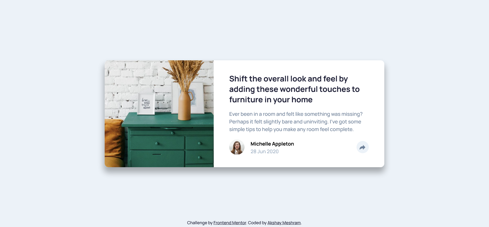

# Frontend Mentor - Article preview component

This is a solution to the [FAQ accordion card challenge on Frontend Mentor](https://www.frontendmentor.io/challenges/article-preview-component-dYBN_pYFT). Frontend Mentor challenges help you improve your coding skills by building realistic projects.

## Table of contents

- [Overview](#overview)
  - [The challenge](#the-challenge)
  - [Screenshot](#screenshot)
  - [Links](#links)
- [My process](#my-process)
  - [Built with](#built-with)
  - [What I learned](#what-i-learned)
  - [Continued development](#continued-development)
  - [Useful resources](#useful-resources)
- [Author](#author)
- [Acknowledgments](#acknowledgments)

## Overview

### The challenge

Users should be able to:

- View the optimal layout for the component depending on their device's screen size
- See hover states for all interactive elements on the page

### Screenshot

### Links

- Solution URL: [https://www.frontendmentor.io/solutions/faq-accordion-card-nvrYhsaQn-](https://www.frontendmentor.io/solutions/faq-accordion-card-nvrYhsaQn-)
- Live Site URL: [https://faq-accordion-card-xi-seven.vercel.app/](https://faq-accordion-card-xi-seven.vercel.app/)

## My process

### Built with

- Semantic HTML5 markup
- CSS custom properties
- Flexbox
- Grid
- SASS

### What I learned

In this project, I have used SASS and tried to use most of its useful and recent features.

### Continued development

There are still improvements needed as far as using SASS fully and in animation section too.

### Useful resources

- [Resource1: For using SASS](https://www.youtube.com/watch?v=ztEY-uber4U)
- [Resource2: For using SASS](https://www.youtube.com/watch?v=CR-a8upNjJ0)
- [Resource3: For using SASS](https://www.devextent.com/dart-sass-javascript-implementation-npm-compile-sass/)
- [Resource4: For using SASS](https://sass-lang.com/documentation/js-api/)

## Author

- Frontend Mentor - [@akshay63](https://www.frontendmentor.io/profile/akshay63)
- Twitter - [@aka_akshaymesh](https://www.twitter.com/aka_akshaymesh)

## Acknowledgments
